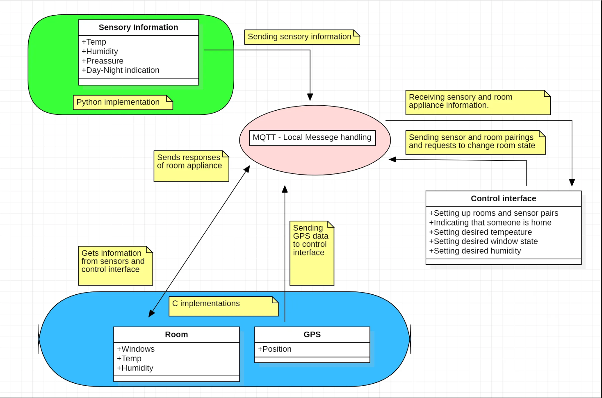

# Smart-home-project
Repo for ERTS project

Authors: Tornai Zsolt Bálint, Kriston Milán
# Project Work share
Zsolt:
1. Room module C implementation
2. GPS module behaviour modelling
3. System overview diagram
4. Original web control creation

Milán:
1. Python sensor data handling
2. MQTT communication setup 
3. Progress Report
4. Extending GPS module and control webpage

# System requirements
Running mqtt broker requires linux distribution, as it was tested both on Raspbian and Ubuntu OS-s.
Running the C components also require linux system because of the Real-Time signal handling.

Installed MQTT.

Installed python packages:
1. Sensehat
2. paho-mqtt

# System overview

The system currently doesn't use humidity or other sensordata, and do not take into consideration anything regarding window handling. These features could be extended later easily.
The system is able to handle up to 5 rooms at once.
# System usage
Command assuming we start from Project folder
1. Starting the MQTT broker
```
cd mqtt
mosquitto -p 2023 -c mosquitto.conf -v
```
2. Starting web control
Just simply double click web/index.html --> Connect to mqtt

3. Starting either random data generation or sensehat data gathering, if one wishes to change the connection adress it can be easily modified with the broker adress variable.
```
python random_sensor.py
```
OR
```
python sensehat.py
```
4. Start room module - all C module require position argument "BROKER ADRESS"
```
cd C
./room.out "localhost"
```
In another terminal(OPTIONAL):
  ```
./gpsPosition.out "localhost"
```
5. Use control page to assess the system.
6. If one wishes to rebuild the C components:
 ```
 gcc room.c -lmosquitto -o room.out
 gcc gpsPosition.c -lmosquitto -o gpsPosition.out

```
7. If ones wishes to change broker adress for the control environment it can be done in web/logic.js with the variable host.
  


